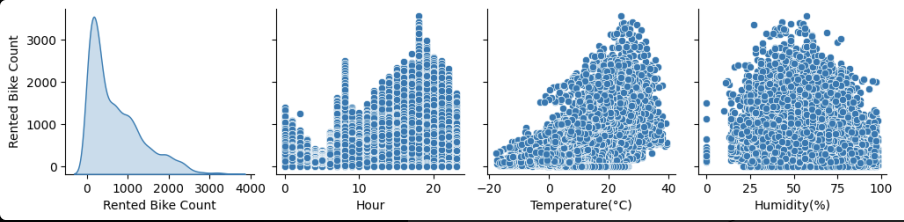
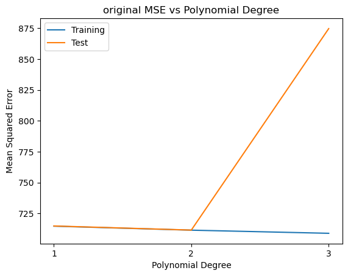
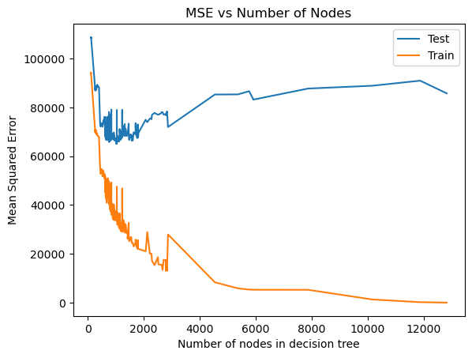

# CSE151A_Group_Project

Notebook Link: [https://colab.research.google.com/drive/1748EV2Sbf0I69aJNW2KFquCi2FpQOLMA?usp=sharing](https://colab.research.google.com/drive/1rqXG1tEI_nTDLgZxeTXwmq--Nhsp5cPs?usp=sharing)

# Milestone 2 

## Plans for Preprocessing
After exploring our data, we found out that we are not missing any data and there does not seem to be any abnormal data. Therefore, we do not plan on replacing any values or dropping any data. There are several columns in which we need to encode the data for future use.

Date:  We need to encode the date. The current format is a string, DD/MM/YYYY. As it is easier to work with numerical data, a possible encoding scheme is to convert the date to number of days from the starting date. However, this would lose some information such as the day of the week. We plan to apply min/max scaling, in order to compare the attributes against each other.  

Rented Bike Count: This is our target and we do not plan on making any changes to the data.

Hour, Temperature, Humidity, Wind Speed, Visibility, Dew Point Temperature, Solar Radiation, Rainfall, Snowfall: We will be scaling these features using min/max scaling. We will be doing this in order to compare the attributes against each other.

Seasons: The current format are in strings. We would be label encoding these data to a scale of 0 to 3. This will aid in our future analysis. As for the other feature, we will as well apply min/max scaling to the season features for the same reason. 

Holiday, Functioning Day: The data is in Yes/No format. Since this is essentially boolean data, we will be using label encoding to convert these data.

# Milestone 3 

## Finish Major Preprocessing 
We encoded the date as the date of the year, which is slightly different than the continuos numbers we originally proposed. However date of the year turned out to be easier to encode and we assume that this will also generalize better. For the other features we sticked to our originally ideas for encoding. 
Finally, we applied min-max-scaling.

All preprocessing can be found in [1_preprocessing.ipynb](/1_preprocessing.ipynb).

**Milestone 4 Update:** in accordance to the feedback we got on gradescope, we updated our scaling of the testing data and the scaling of our MSE. 

# Milestone 3 & 4 

## Methods 

### Train your first model 
Because of simplicity our first choice was linear/polynomial regression. We tried up to degree 4. 
After plotting our fitting graph, we notice that the training MSE decreases as the polynomial degree increases. However, the testing MSE decreases from degree 1 to degree 2 and increases from degree 2 onwards. After degree 2, our model shows signs of overfitting. Therefore, we believe a second degree polynomial model fits our dataset the best.

Our first model can be found in [2_first_model.ipynb](/2_first_model.ipynb).

### Train your second model 

As proposed in the last submission we implemented decision trees. We first tried the default settings of the DecisionTreeRegressor from sklearn. As warned in the documentation we got an extremely complex model with 13347 nodes and a depth of 32 which overfits our model heavily. 
Consequently, we limited the max_depth of our model and tried out parameters in the range from 1 to 20 for this. Limiting the max_depth is a simple way to keep the model smaller. We saw that a depth of 12 provided us with significantly better results. However the MSEs were still noticeably high. Thus, we decided to utilize hyperparameter tuning by making use of the grid search approach. Grid search is a basic, but relatively costly as exponential way of trying out hyperparameters as it is testing every possible combination of the hyperparameter values. As we do not have computation power issues yet we decided it is sufficient for our implementation.  
We adjusted the feature ranges until we had best results that were not at the boundary but in the middle of each interval. By that we ensured that there are no better values right outside of our interval. 

Our second model can be found in [3_second_model.ipynb](/3_second_model.ipynb).


## Conclusion 

### First model
[2_first_model.ipynb](/2_first_model.ipynb)

#### Where does your first model fit in the fitting graph? 
The degree 1 model is underfitting as both train as well as test error are high. Degree seems to fit well with a test error higher than the train error but both in acceptable range. Degree 3 and especially degree 4 show overfitting with a very high test error, while achieving a low training error.

#### What are the next models you are thinking of and why? 
##### Decision Trees 
Next, we would like to try decision trees. Many of the features seem easy to split. E.g. for the rainfall a split on no rain vs rain or rain, little rain (amount of mm yet to be decided), heavy rain. Also hour could be split to divide the day into night vs day, or smaller differentiation. 

#### What is the conclusion of your 1st model? What can be done to possibly improve it? 
For a first approach the results are not too bad. A degree of two provides us with solid results. 
##### Feature Expansion
Another approach would be feature expansion. 
We could create a new feature that represents an overall weather score by combining temperature, rainfall, humidity, wind speed and solar radiation, and dew point. Eventually sub-combinations like temperature and humidity or temperature and wind speed can be more beneficial. 
We might also create a feature whether it is a working day or a weekend. 
##### Ridge or Lasso Regression 
Instead of simple polynomial regression exploring regularization by using Ridge or Lasso regression might also be a good idea. 

### Second Model 
[3_second_model.ipynb](/3_second_model.ipynb)

#### Where does your second model fit in the fitting graph? 
With the hyperparameter tuning we ensured that we neither have a totally over- or under-fitting model. However, the MSE values are quite high compare to what we achieved with the polynomial regression model. 

#### What is the conclusion of your second model? What can be done to possibly improve it? 
Currently, the results are not satisfying compared to our initial polynomial regression model. 
Eventually, we should intensify our hyperparameter tuning considering the remaining parameters such as min_weight_fraction_leaf, max_features, max_leaf_nodes and ccp_alpha=0.0 which we have not specified yet. 
Manually preprocessing our data for the decision tree might also help. We could manually introduce thresholds for splitting the data. Another than that decision trees in comparison to polynomial regression tend to struggle more with identifying feature interaction consequently we should maybe reduce the number of features used in our model and e.g. use an overall weather score instead of the multiple weather patterns. This would also prevent our tree from becoming too large. 


# Milestone 5: final report

## 1. Introduction
For our project, we decided to use a Seoul bike rental dataset from the UC Irvine Machine Learning Repository. This dataset contains information about public bike rentals in Seoul from 2017 to 2018, along with weather and holiday information for each day within that timeframe. We chose this dataset because we thought trying to predict bike rental numbers using weather and holiday information was interesting, and we were curious to see if our assumptions–that bike rentals would be higher on days with good weather and on weekends or holidays–were correct. Plus, a few of us are bike enthusiasts, so this dataset seemed like a cool way to incorporate our interests into the project. 

In general, having a good predictive model is important because such models can be incredibly useful. At UCSD, for example, machine learning is being applied to all sorts of things, from signal recovery to analyzing bird calls. Additionally, a bad predictive model isn't just a nuisance, but can actually cause significant harm: as we've mentioned before in class, if a model incorrectly predicts that someone doesn't have cancer when they actually do, that mistake can cost the person their life. 

## 2. Methods
### 2.1 Data Exploration
We levereged several pandas functions to explore our dataset. We used ```bike_data.head()``` to get a feel of what the dataset looked like. We also looked at ```bike_data.shape``` and ```bike_data.dtypes``` of the dataset to get a feel of the shape and data types we were working with. We also briefly explored the pairplot of our data to get any impressions from our data with 
```
sns.pairplot(bike_data, diag_kind='kde')
```
We checked if there were any null values with: 
```
bike_data.isnull().sum()
```
We checked for unique values to get an idea of the range we were working with: 
```
for col in bike_data.columns:
    print(col, bike_data[col].unique())
```
We then used 
```
bike_data.describe()
```
to see if the min and max values were in a reasonable range. We also looked at the correlation matrix to see if there were any relationships of note with:
```
heat_map = sns.heatmap((bike_data.drop(columns=["Seasons", "Holiday", "Functioning Day", "Date"])).corr(), annot = True, fmt='.2', vmin=-1, vmax=1, center= 0)
heat_map.set_title("Correlation Matrix", fontsize=16)
```

### 2.2 Preprocessing
We encoded the date as the date of the year with: 
```
bike_data['Date_Converted'] = pd.to_datetime(bike_data['Date'], format='%d/%m/%Y')
bike_data['Day_of_Year'] = bike_data['Date_Converted'].dt.dayofyear
```
We encoded the seasons from strings to an integer from 0-3 with a label encoder: 
```
myle = LabelEncoder()
bike_data['Seasons'] = myle.fit_transform(bike_data['Seasons'])
```
Holidays were label encoded from a holiday/noholiday to a 1/0 with 
```
bike_data['Holiday'] = bike_data['Holiday'].map({'Holiday': 1, 'No Holiday': 0})
```
Functioning day was also encoded with 
```
bike_data['Functioning Day'] = bike_data['Functioning Day'].map({'Yes': 1, 'No': 0})
```
All Attributes were scaled using min-max scaling: 
```
scaler = MinMaxScaler()
```
All preprocessing can be found in [1_preprocessing.ipynb](https://github.com/dennisliang01/CSE151A_Group_Project/blob/Milestone3/1_preprocessing.ipynb).

### 2.3 Model 1: Polynomial Regression
Our first model we tried was a linear regression model, and then a polynomial regression model with degrees from 2-4. For reasons we will discuss later, we decided to use degree 2 for our final polynomial regression model. Our first model can be found in [2_first_model.ipynb](https://github.com/dennisliang01/CSE151A_Group_Project/blob/Milestone3/2_first_model.ipynb).

### 2.4 Model 2: Decision Trees
Our second model was a decision tree. We did not scale our attributes since decisions trees are not sensitive to outliers. We used gridsearch to find the optimal hyperparameters. The optimal parameters used in our final model were: max_depth=20, min_samples_leaf=6, min_samples_split=24. Keep in mind we did not do an entirely exhaustive search, so there are other parameters that were not tuned. Our second model can be found in [3_second_model.ipynb](https://github.com/dennisliang01/CSE151A_Group_Project/blob/Milestone4/3_second_model.ipynb).


## 3. Results

### 3.1 Data Exploration
When first exploring our data, we found that we had 14 features and 8760 observations in our dataset. Looking more, we found no null data, and multiple data types, some of which would need to be encoded. Our correlation matrix illustrated a higher correlation between temperatuure and time of day with the number of bikes rented.



### 3.2 Preprocessing
First, we encoded our day of year from a data with slashes, to integer values between 1 and 365, as well as our seasons from objects [Winter, Spring, Summer Autumn] to the numerical labels, [3, 1, 2, 0] respectively. Finally we encoded the [Yes,No] values of the Functioning Day column and the [Holiday, No Holiday] values of the Holiday column to both [1, 0] respectively.

### 3.3 Model 1: Polynomial Regression
For our first model, polynomial regression, we iterated through different degrees of polynomial fits, finding an exorbitant mse at degree four, and our best fit at degree two. This is because the mse drastically rose onwards, especially for test mse, a clear sign of overfitting on our dataset. Earlier on, we noticed that the simpler our model, i.e. only one or two degree polynomial fit best represented our data, indicating a more complex model might not be ideal. Regardless, we decided to move to a decision tree regression model, as we felt many of our features, such as temperature, weather and season were correlated with each other and bike share count.



### 3.4 Model 2: Decision Tree Regression
Performing a decision tree regressor model, we added a level of complexity due to the comparison between many more features than in polynomial regression, but multiple splits in data at each decision node. First obtaining a clearly overfitted curve, we limited our max depth, before performing a grid search cross validation, which still found that the max depth 20, min sample leaf of 6, and min sample split of 24 were the best parameters. On our fitting graph, we found that the mse showed a continuous downfall until about 1500-2000 nodes in the decision tree, after which our mse for testing shot up, while training remained low—a clear sign of overfitting. Despite finding these optimal hyperparameters, our mse for both training and testing remained significantly higher, meaning either: a simpler model such as polynomial regression may be the best fit, or that we need a model such as neural networks which will consider further underlying connections between features other models cannot pick up on. 



## 4. Discussion

### Preprocessing 
Our chosen dataset has 8760 entries with 14 features each. It is a complete dataset which did not include any abnormal looking data. Thus, we did not need to sanitize but only to encode data. We had to encode dates, seasons, and holiday as well as functioning day. The dates were saved in a String format of DD/MM/YYYY which we converted to the day of the year format. This enabled us to keep the sequentially. However, we lost the option to derive the day of the week.  Seasons were as well saved as strings, so we decided to apply label encoding. As holiday and functioning day are in a yes format, we label encoded this boolean data. The rest of the features namely Hour, Temperature, Humidity, Wind Speed, Visibility, Dew Point Temperature, Solar Radiation, Rainfall, Snowfall are already in numerical format. To be able to compare attributes against each other we scaled them using min-max-scaling. 

### Polynomial Regression
Our first idea was to implement the simplest possible model in order to have a baseline to compare more complicated models to later on. Our bike sharing predictions are continues values. Thus, linear regression is the simplest way to predict the number of bikes rented. As a basic approach we just used every feature and did not create combined features etc. 
While a linear model yielded results, we continued with increasing the degree of our models. It turned out that degree two had the best train test error ratio. Degrees higher than two showed significant signs of overfitting. Those results are illustrated in the following fitting graph. 


### Binary Decision Trees 
Our next approach was a binary decision tree. 
As a first model with default settings let to an extremely complex overfitting model with 13347, which is a common behaviour according to the documentation, we started tuning hyperparameters. As the max_depth is a simple parameter to control the size, and therefore complexity of the decision tree. Within the tried range of 1 to 20 a depth of 12 leading to a tree with 2865 nodes turned out to be best with a train MSE of 27945.93 and a test MSE of 71971.45. As this is still bey far higher than our errors with the simple polynomial regression model we continued our search. 
Our grid search with the following parameters 
```
param_grid = {
    'max_depth': [6, 8, 10, 12, 16, 18, 20, 22],
    'min_samples_split': [2, 10, 18, 16, 24, 30],
    'min_samples_leaf': [1, 2, 4, 6, 8, 10],
    'criterion': ['squared_error']
}
```
led to a max_depth of 20, min_samples_leaf of 6 and a min_samples_split of 24, with train MSE 33551.06 and test MSE: 65080.17 on a tree with 1033 nodes. We chose the number of nodes in the decision tree for measuring the complexity of our model. Models with similar many nodes are not necessarily fitted with the same parameters as the combination of parameters (e.g. max_depthmin_samples_split, min_samples_leaf) can be different. 
For showing the fitting graph we recompute all models in order to obtain the train mse, and test mse values. As this method is not based on cross validation (compared to the grid-search library we used beforehand), but on a fixed split, it might lead to slightly different results for the optimal model complexity. However, we clearly see that around 1000 to 1500 nodes are a reasonable model complexity. Thus our model is within the area of the minimum of the test mse curve. 

The current results are not satisfying compared to our initial polynomial regression model with a train error of 711.37 and a test error of 711.43. 
To improve our results, we might have to intensify our hyperparameter tuning considering the remaining parameters such as min_weight_fraction_leaf, max_features, max_leaf_nodes and ccp_alpha=0.0 which we have not specified yet.

### Future Ideas for both models. 
Feature expansion is likely to yield better results for our models. Potential options are creating an overall weather score by combining temperature, rainfall, humidity, wind speed and solar radiation, and dew point or eventually sub-combinations like temperature and humidity or temperature and wind speed. This might especially be helpful for the binary tree approach as it collapsing those features into one would significantly decrease the size of the decision tree. 


## 5. Conclusion
Overall, our project showed that predicting bike rentals using weather and holidy data is feasible with polynomial regression providing the best results among the models we implemented. While decision trees offered insights into data splits, they underperformed compared to polynomial regression and also increased the complexity of the model.

In the future, we would like to introduce new features such as a composite weather score to make it easier to predict bike rentals and improve our model performance. We would also like to explore new models such as neural networks to see if they can improve our results. Our Hyperparameter tuning was limited by the time we had to work on the project, so we would like to explore more hyperparameter tuning in the future. Due to the exhaustive nature of hyperparameter tuninng, we also hope to utilize more computing resouces such as the San Diego Supercomputing Center.

Finally, we believe having more data would also help improve the accuracy of our model. During our initial project research, we found there were other bike sharing datasets from other countries around the world. The only challenge with incorporating multiple datasets is to ensure that the data is consistent and that the features are comparable.

## 6. Statement of Collaboration

Roles: We did have have clearly defined roles. Everyone worked as a team and contributed to the project. We held each other responsible and had interchangable roles.

Name: Ryan Do  
Contribution: Helped organize meetings. Discussed and helped code milestones. Wrote the methods section of final report. Gave feedback on code and other member's contribution to final report.

Name: April Hsu  
Contribution: Took part and contributed in group meetings when working on milestones 1-4, wrote intro for milestone 5.

Name: Dennis Liang  
Contribution: Contributed to coding and reviewing the writeup for each milestone. Helped organize meetings and define goals. Provided feedback on others code and final report contribution. Wrote conclusion section for final report.

Name: Isabel Marie Pfannmueller  
Contribution: Contribution to weekly coding meetings; Contact to TAs before submitting the second milestone, refactoring of project structure, writeups and explanations for milestones, code cleanup, discussion section of final report, feedback on others code and final report contribution.

Rylen Sabhlok:  
Contribution: Discussion and collaboration on weekly meetings for each milestone. Wrote results section for final report, gave advise and feedback on code, helped plan project and decide on models and milestone summaries/descriptions.


